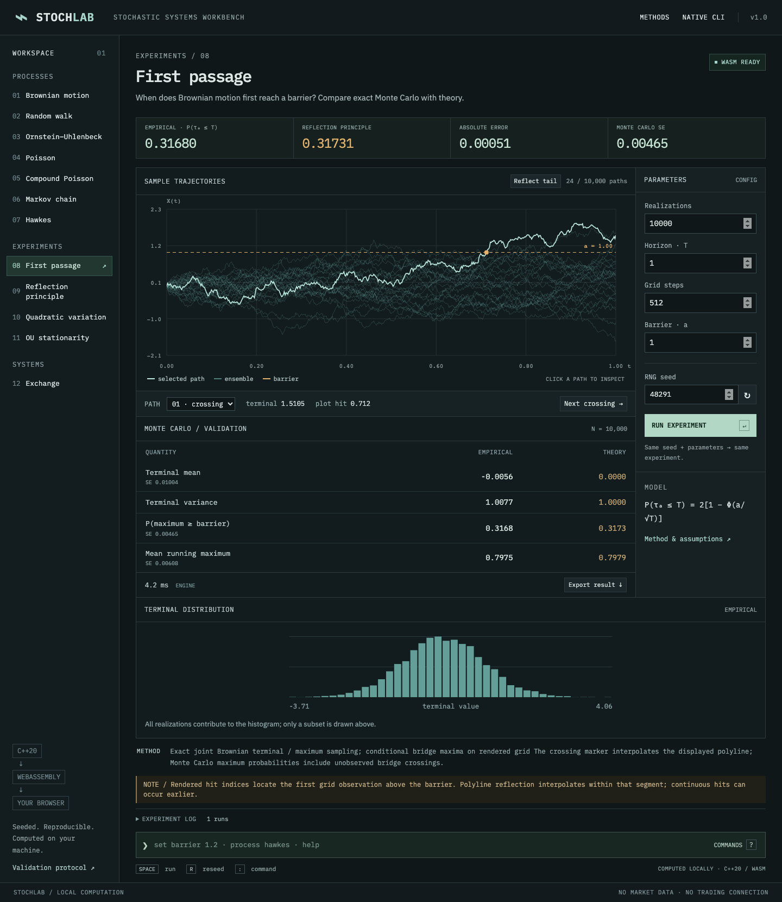
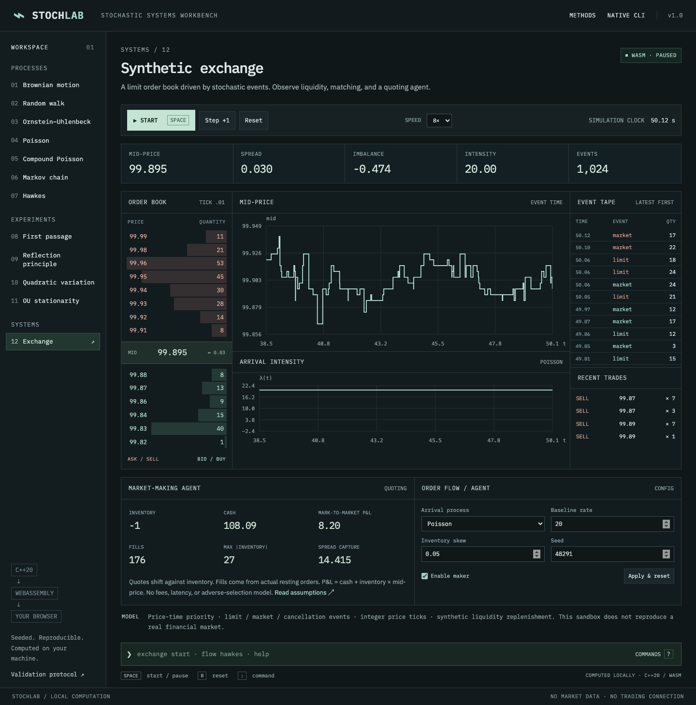

# StochLab

### An interactive stochastic systems workbench

[Open the live workbench](https://stochlab.brandonling22.workers.dev) · [Project status and measured results](PROJECT_STATUS.md)

StochLab makes stochastic models inspectable: generate trajectories, compare Monte
Carlo estimates with theory, reflect Brownian paths, watch self-exciting arrivals,
and operate an event-driven limit order book.

A **C++20 engine** powers both a native CLI and an **Emscripten WebAssembly module**.
An **Astro + React** workbench runs that module in a dedicated Web Worker. There
is no JavaScript implementation of the stochastic models and no simulation backend.



## What you can explore

| Workspace                  | Model / algorithm                                                           | Inspect                                               |
| -------------------------- | --------------------------------------------------------------------------- | ----------------------------------------------------- |
| Random walk                | Symmetric Bernoulli increments, diffusive scaling                           | Lattice paths and terminal distribution               |
| Brownian motion            | Exact Gaussian grid increments                                              | Paths, terminal law, maxima and barriers              |
| First passage / reflection | Exact conditional Brownian bridge maxima                                    | Crossing probability, selected paths, reflected tails |
| Quadratic variation        | Nested path partitions; exact Gaussian/chi-square projection for aggregates | Convergence to elapsed time                           |
| Ornstein–Uhlenbeck         | Exact Gaussian transitions, stable small-time arithmetic                    | Mean reversion, finite-time and stationary moments    |
| Poisson / compound Poisson | Exact exponential waits; independent Gaussian marks                         | Counting paths, jumps, arrival rasters                |
| Finite-state CTMC          | Exact holding times and state transitions; pivoted stationary solve         | Custom generators, occupation fractions               |
| Hawkes                     | Ogata thinning, exponential kernel                                          | Intensity jumps, decay, clustering, transient theory  |
| Synthetic exchange         | Price-time-priority matching and stochastic order flow                      | Depth, trades, cancellations, inventory and P&L       |

The browser has visible controls, a command line, keyboard shortcuts, path
selection, experiment logs and JSON export. Desktop is the primary surface; narrow
screens collapse panes and expose navigation as a horizontally scrollable strip.

## Architecture

```text
core/include + core/src        C++20
  ├─ SplitMix64 RNG / moments / histograms / validation
  ├─ stochastic processes + exact marginal samplers
  ├─ FIFO OrderBook + Poisson/Hawkes Exchange + MakerLedger
  └─ request(JSON)
       ├─ CMake → native stochlab CLI
       └─ Emscripten → sl_request C ABI → .mjs + .wasm
                             ↓
                        Web Worker
                             ↓
                  React experiment/exchange island
                             ↓
             Astro static routes + shell + methods
                             ↓
                Cloudflare Workers static assets
```

C++ keeps mathematical and matching logic shared and makes native throughput
measurable. WASM brings that exact implementation into the browser. Astro
prerenders navigation, metadata and reference pages; only the working surfaces
hydrate. Canvas handles dense paths and live history, while small SVG plots show
histograms, event rasters and quadratic variation. Fonts are bundled locally.

The C ABI accepts a JSON request and returns a JSON string owned by the module
until the next call. A worker parses it and returns the bounded result. Every
requested realization contributes to statistics, while at most **24 continuous
paths or 8 event paths** cross the boundary. This avoids sending a million-path
matrix through JavaScript. The boundary, including caught C++ errors, is covered
by WASM integration tests.

## Quick start

Requirements: **C++20 compiler**, **CMake 3.20+**, **Make**, **Node.js 24.2+** and npm.
The native target has no downloaded build dependencies; nlohmann/json 3.12.0 is
vendored with its license.

```sh
make native
./build/stochlab --help
make test
make bench
```

For the browser, install the pinned Emscripten compiler in a local tools directory:

```sh
git clone --depth 1 https://github.com/emscripten-core/emsdk.git work/emsdk
cd work/emsdk
./emsdk install 4.0.16
./emsdk activate 4.0.16
cd ../..
source work/emsdk/emsdk_env.sh

npm ci
npm run build:wasm
npm run dev
```

Open the local URL printed by Astro (normally http://127.0.0.1:4321).
If Emscripten is already installed, source its environment instead of installing
another copy. Source that environment in each shell used for WASM builds.
Generated WASM is intentionally excluded from Git; build it before starting the UI.

## Native CLI

```sh
./build/stochlab simulate brownian --paths 100000 --T 1 --seed 42
./build/stochlab experiment first-passage --barrier 1 --paths 1000000 --seed 42
./build/stochlab experiment qv --steps 1024 --paths 100000
./build/stochlab simulate ou --theta 2 --mu 0 --sigma 1 --T 10
./build/stochlab simulate poisson --lambda 5 --T 10
./build/stochlab simulate compound-poisson --lambda 5 --jump_mean .1 --jump_sigma .5
./build/stochlab simulate ctmc --Q '[[-2,2],[1,-1]]' --T 100
./build/stochlab simulate hawkes --mu .2 --alpha .7 --beta 1.1 --T 30
./build/stochlab exchange --events 100000 --flow hawkes --maker on --seed 42
./build/stochlab simulate brownian --paths 1000 --json
```

Argument parsing rejects unknown options, missing values, nonfinite numbers and
invalid workloads. `--json` returns the same result schema used by WASM.
Native output separates empirical measurements, theoretical values, and
parameter/reference diagnostics.

## Browser commands

```text
:process brownian
:set barrier 1.2
:set paths 100000
:seed 42
:run
:reseed
:help

:exchange start
:exchange pause
:flow hawkes
:maker enable
:speed 4x
```

**Space** runs an experiment or toggles the exchange. **R** reseeds or resets.
**:** focuses the command line. **↑ / ↓** recall command history. Shortcuts do
not intercept typing in controls. Experiment changes require Run; exchange
configuration changes use Apply & reset.

## Scientific correctness

- Brownian terminal values are N(0,T). First-passage theory is
  `P(τₐ ≤ T) = erfc(a / sqrt(2T))`.
- A rendered grid can miss a continuous crossing. Aggregate maxima sample the
  exact Brownian bridge law, including excursions between grid observations.
  Reflection is the geometry of the displayed polyline, with an interpolated
  barrier intersection; it is not an exact continuous hitting-time sample.
- OU uses exact transitions. Small-time drift and variance use stable
  `expm1` expressions, including a regression for θT = 10⁻¹².
- Poisson and CTMC advance to exact event times, not time buckets.
- Hawkes theory includes the empty-history startup transient. Its stationary
  mean intensity is a separately labeled reference, not a finite-horizon count.
- Variance uses the unbiased n−1 estimator. SE means one Monte Carlo standard
  error. Single-realization variance is marked as unestimable.
- Seeded output is repeatable in the same build/runtime apart from elapsed time.
  Native/WASM floating-point results are checked within tolerance; platform
  transcendental rounding is not promised to be bit-identical.

[Mathematical definitions, algorithms, bounds and sources](docs/MATHEMATICS.md)
document every model. The native suite includes **18 statistical comparisons**
and deterministic process/order/accounting invariants. An independent audit also
found and fixed an explicit-seed parsing issue and OU small-time cancellation.

## Synthetic exchange and agent



Individual orders rest in FIFO lists inside ordered price levels, with an ID
index for cancellations. Limit orders cross eligible opposing levels at resting
prices; market orders sweep available depth; unmatched market quantity is
discarded. Tick size is 0.01. Bid/ask, midpoint, spread and displayed-depth
imbalance all come from the actual book.

External events choose limit, market and cancellation actions with probabilities
52%, 30% and 18%. Poisson or exponential-kernel Hawkes clocks drive those events.
Explicitly labeled reservoir and capacity-maintenance actions keep the book
two-sided and bounded. These synthetic rules materially affect price dynamics.

One inventory-skew maker posts ordinary passive orders, loses queue priority when
requoting, and receives fills only when its orders match. Integer cash and inventory
feed midpoint P&L. Inventory is limited to ±100. No fees, latency, calibration or
real trading connectivity are modeled. There is no claim of profitability.

[Exchange and market-maker specification](docs/EXCHANGE.md) covers order placement,
queue rules, maintenance, accounting and all simplifications.

## Tests and production build

```sh
# Native unit, exchange, CLI and statistical checks
make test
make validate

# WASM + Astro type checking + production frontend
npm run build

# Commands, reflection geometry, all-model native/WASM parity, errors, exchange
npm test

# Install a test browser once, then test the production build
npx playwright install chromium
npm run test:browser

# Formatting and compiler checks
npm run format:check
clang-format --dry-run --Werror core/src/*.cpp \
  core/include/stochlab/api.hpp core/include/stochlab/processes.hpp \
  core/include/stochlab/exchange.hpp core/include/stochlab/rng.hpp tests/*.cpp

# Optional sanitizer build
cmake -S . -B build-sanitize -DCMAKE_BUILD_TYPE=Debug -DSTOCHLAB_SANITIZE=ON
cmake --build build-sanitize --parallel
ctest --test-dir build-sanitize --output-on-failure
```

Playwright starts or reuses the production preview server. It checks fresh deep
links, all models, million-path work, command parsing, keyboard interaction,
reflection, export, invalid-parameter recovery, exchange flow changes and
390/768/1280px layouts. The screenshot test records actual simulation results in
`docs/screenshots/`. To run the same suite against a deployment, set
`BASE_URL=https://your-deployment.example`.

## Benchmarks

Run `make bench` or `./build/stochlab bench --json`. The suite performs one
warmup and reports the median of three timed runs using seed 42. Measurements are
machine-specific and exclude JSON text serialization.

The recorded run is in [docs/benchmarks.json](docs/benchmarks.json); its environment
and results are summarized in [PROJECT_STATUS.md](PROJECT_STATUS.md).
Brownian grid generation measures 10,240,000 actual increments. The million-path
first-passage benchmark instead uses exact endpoint/maximum sampling. Those
throughputs describe different workloads and should not be compared as full-path
generation rates.

## Deployment

`npm run build` produces 16 static pages and the WASM module. Cloudflare Workers
serves those assets directly; there is no application server, database or secret in
the frontend. `wrangler.jsonc` configures canonical trailing slashes and a real
404 page. WASM and its loader revalidate on deployment; hashed Astro assets use
content-addressed filenames.

```sh
npx wrangler login
npx wrangler deploy --dry-run
npm run deploy
```

Use the authenticated account intended for your own deployment. Production is live at [stochlab.brandonling22.workers.dev](https://stochlab.brandonling22.workers.dev).
Live verification is recorded in [PROJECT_STATUS.md](PROJECT_STATUS.md).
No custom DNS changes are required.

## Deliberate limits

The workbench is serial and bounded: up to one million Monte Carlo realizations,
with stricter event/step work budgets. Large requests fail explicitly instead of
returning truncated aggregates. There is no persistence or export of every
simulated path. Generic CTMCs support up to 16 states; unreliable or nonunique
stationary solutions are omitted. Hawkes is univariate with an exponential
kernel in the stable regime. The exchange is a synthetic mechanism, not a
calibrated financial market.

Possible extensions include reproducible per-path parallel streams, binary
typed-array transfers for larger visual ensembles, continuous hitting-time
samplers, and multivariate marked Hawkes flow. These are outside v1.

## License

MIT for StochLab code. See [third-party notices](THIRD_PARTY_NOTICES.md) for the
vendored JSON header and IBM Plex fonts.
